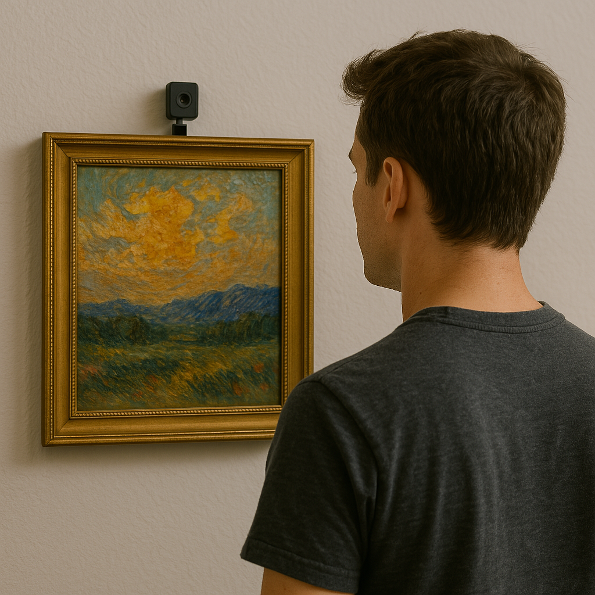

# Affectra Emotion Tracking Web UI


Affectra is a camera-based emotion tracking system with a web-based user interface.  
It detects faces, analyzes facial emotions, tracks viewer sessions, and visualizes emotion statistics over time.

---

## 🖼️ Design Concept

> The following image illustrates how Affectra could appear in a real-world setting.

<!--  -->


---

## ✨ Features

- Real-time face detection and emotion analysis  
- Session tracking with emotion distribution summary  
- Web UI for live monitoring and data visualization  
- CSV-based logging of historical emotion data  
- Tracks total number of visitors (sessions)  
- Option to clear stored data when needed  
- Support for multiple camera sources:
  - Local webcam 
  - ESP32-CAM external camera

---

## 🔐 Security Features

This project includes several application-level security measures:

- CSRF protection for all form submissions  
- Secure HTTP headers (CSP, HSTS, X-Content-Type-Options, X-Frame-Options)  
- Input validation and sanitization to prevent injection attacks  
- Symmetric encryption using Fernet for sensitive data  
- Robust error handling and sanitized structured logging  
- Directory permission checks and secure file operations  

---

## ⚙️ Requirements

- Python 3.7+
- Flask
- OpenCV
- DeepFace
- Pandas
- NumPy

---

## 🚀 Setup

1. Install dependencies:
   ```bash
   pip install -r requirements.txt
   ```

2. Ensure your webcam is connected and accessible.

3. (Optional) To use an ESP32-CAM:
   - Flash the ESP32-CAM using `esp32_cam/esp32_cam_streaming.ino`
   - Update Wi-Fi credentials in the Arduino code
   - Connect the ESP32-CAM to your network
   - Note the IP address displayed on the ESP32 serial monitor

---

## 🖥️ Running the Application

Start the Flask web server:

```bash
python server/app.py
```

Start the camera emotion tracker:

```bash
python client/camera_tracker.py
```

Then open your browser and visit:

[http://localhost:5000](http://localhost:5000)

---

## 🎛️ Using the Interface

- **Live Feed**: Left panel shows real-time camera feed with face and emotion labels  
- **Session Statistics**: Right panel shows:
  - Total number of sessions
  - Most frequent emotion
  - Average session duration
  - Emotion distribution as percentages
- **Controls**:
  - 🔄 Refresh Statistics
  - 🧹 Clear All Data (with confirmation)
- **Camera Selection**:
  - Switch between webcam and ESP32-CAM
  - Add new ESP32-CAM sources by entering their stream URL

---

## 📷 Using ESP32-CAM

1. Flash the ESP32-CAM with the provided Arduino code  
2. Connect it to the same network as the Affectra server  
3. Note the IP address from the serial monitor  
4. In the UI, click “Add ESP32-CAM” and enter:
   ```
   http://<ESP32-CAM_IP>/stream
   ```
5. Select it from the list to start streaming

---

## 🧠 How It Works

1. Camera captures frames from webcam or ESP32-CAM  
2. DeepFace detects faces and classifies emotions  
3. Affectra tracks each viewer session and logs:
   - Session start/end time
   - Duration in seconds
   - Emotion percentages
4. Web UI reads from CSV and updates statistics in real-time

---

## 📁 Project Structure

```
Affectra/
├── server/
│   ├── app.py
│   ├── templates/
│   ├── static/
│   └── storage/
├── client/
│   ├── camera_tracker.py
│   ├── camera_provider.py
│   └── emotion_utils.py
├── esp32_cam/
│   └── esp32_cam_streaming.ino
├── assets/
│   ├── affectra-logo.png
│   └── affectra-demo.png
└── run_app.py
```

---


